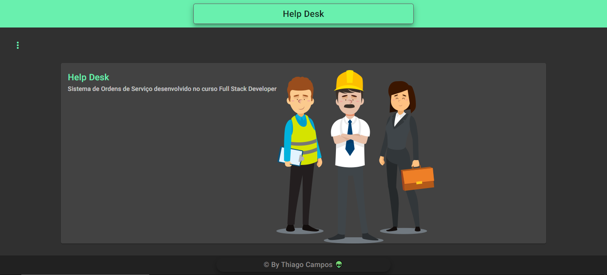

# Sistema Help Desk

Neste projeto construi uma aplicação web completa, CRUD (CREATE, READ, UPDATE e DELETE) de um sistema simples de gerenciamento de Ordens de Serviço.

## VISÃO TÉCNICA - FRONT END:

utilizando Angular 16 e inserindo conceitos do Orientação a Objetos no Typescript construindo com a arquitetura MVC do Angular, os componentes visuais do Angular Material, Angular reactive forms, navegação.

